# Plant-wide Enterprise Agent Platform
## Architecture Design Document

**Version**: 1.0.0
**Date**: 2026-02-16
**Status**: Draft — Internal Review
**Authors**: Platform Architecture Team

---

## Table of Contents

1. [System Overview](#1-system-overview)
2. [Component Breakdown](#2-component-breakdown)
3. [Data Flow Diagrams](#3-data-flow-diagrams)
4. [Security Model](#4-security-model)
5. [Tech Stack](#5-tech-stack)
6. [Deployment Architecture](#6-deployment-architecture)
7. [Future Extensibility](#7-future-extensibility)
8. [Architectural Decision Records](#8-architectural-decision-records)

---

## 1. System Overview

### 1.1 Purpose

The Plant-wide Enterprise Agent Platform is an on-premises, multi-tenant AI agent infrastructure designed for industrial and enterprise environments. It enables authorized users across operational technology (OT) and information technology (IT) domains to interact with AI agents that have controlled, auditable access to plant systems, documents, and data.

The platform is built on three non-negotiable constraints:

- **Security by Default**: Every request is authenticated, authorized, and logged before execution.
- **Tenant Isolation**: No data or context leaks across organizational boundaries at any layer.
- **Auditability**: Every model call, tool invocation, and data access is recorded with full provenance.

### 1.2 Seven-Layer Architecture

The platform is organized into seven horizontal layers. Each layer has a single responsibility and communicates only with adjacent layers through well-defined interfaces. This structure enforces separation of concerns and makes each layer independently replaceable.

```
Layer 1 — UI            Browser / CLI / External API consumers
Layer 2 — API Gateway   FastAPI, auth enforcement, rate limiting, routing
Layer 3 — Policy Engine RBAC enforcement, tenant isolation, tool access control
Layer 4 — Agent Runtime Conversation state, session management, orchestration
Layer 5 — Tool Layer    Tool Gateway — controlled proxy for all external access
Layer 6 — Model Layer   LiteLLM proxy — model-agnostic routing
Layer 7 — Data Layer    PostgreSQL + pgvector — persistence and vector search
```

### 1.3 C4-Style System Context Diagram

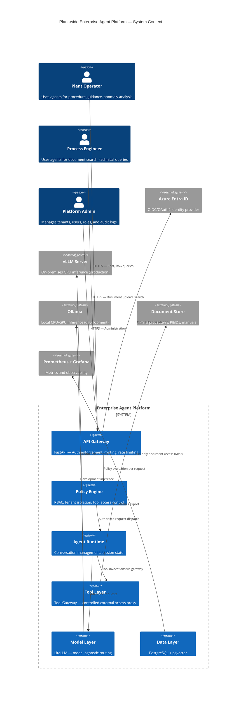

### 1.4 Seven-Layer Internal Diagram

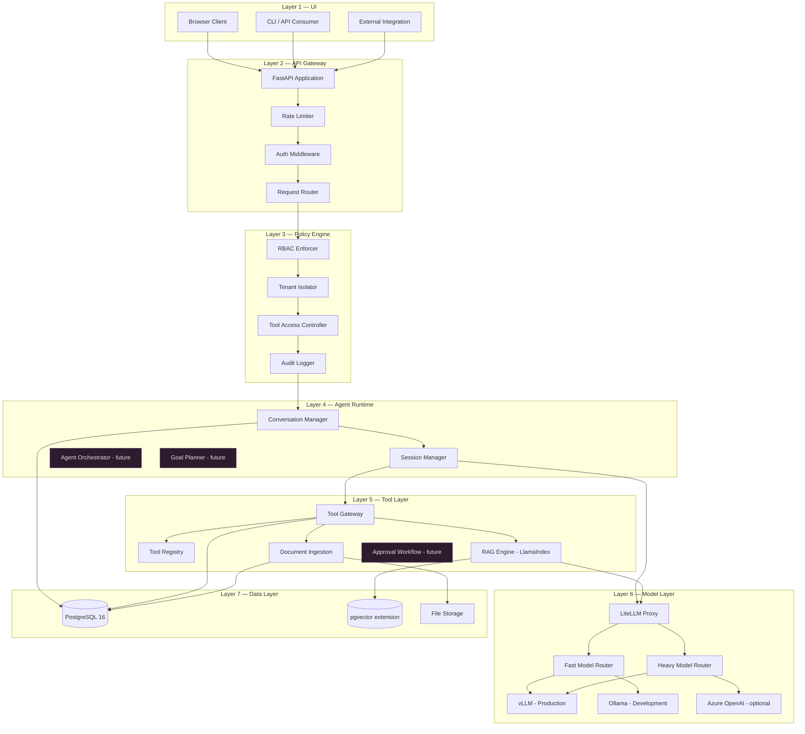

---

## 2. Component Breakdown

### 2.1 API Gateway (Layer 2)

The API Gateway is the single entry point for all client traffic. It handles transport-level concerns — connection management, TLS termination, rate limiting, and request routing — before passing requests into the platform.

**Technology**: Python 3.12 + FastAPI

**Responsibilities**:

| Responsibility | Implementation |
|---|---|
| TLS termination | Reverse proxy (nginx) or cloud load balancer |
| Authentication | JWT validation middleware on every request |
| Authorization | Delegates to Policy Engine after auth |
| Rate limiting | Per-user token bucket (configurable per tier) |
| Request routing | Path-based routing to appropriate handlers |
| Health checks | `/health` and `/ready` endpoints |
| API versioning | `/v1/` prefix with explicit version routing |

**Rate Limiting Strategy**:

Rate limits are enforced per authenticated user identity (`sub` claim from JWT), not per IP. This prevents shared egress IP collisions in plant network environments. Limits are defined in tenant configuration and enforced in Redis or in-process using a sliding window algorithm.

```
Default tiers:
  viewer:  10 requests/minute,  50 requests/hour
  user:    30 requests/minute, 200 requests/hour
  admin:   60 requests/minute, 500 requests/hour
```

**Key API Endpoints (MVP)**:

```
POST   /v1/conversations              Create new conversation
GET    /v1/conversations/{id}         Get conversation history
POST   /v1/conversations/{id}/chat    Send chat message
POST   /v1/documents/upload           Upload document for ingestion
GET    /v1/documents                  List documents (filtered by tenant/role)
GET    /v1/documents/{id}             Get document metadata
POST   /v1/search                     RAG search query
GET    /v1/audit                      Audit log query (admin only)
GET    /v1/health                     Health check
```

**FastAPI Application Structure**:

```
src/
  api/
    v1/
      routers/
        conversations.py
        documents.py
        search.py
        audit.py
        health.py
      middleware/
        auth.py          # JWT validation, principal extraction
        rate_limit.py    # Per-user rate limiting
        audit.py         # Request/response audit capture
        pii.py           # Optional PII sanitization
      dependencies.py    # Shared FastAPI dependencies (db session, user context)
    app.py               # Application factory
    config.py            # Settings via pydantic-settings
```

### 2.2 Policy Engine (Layer 3)

The Policy Engine enforces all access control decisions. It sits between the API Gateway and the Agent Runtime and must approve every request before it proceeds. This is not an optional middleware — it is a hard gate.

**Responsibilities**:

- **RBAC Enforcement**: Evaluate user role against requested resource and operation
- **Tenant Isolation**: Inject `tenant_id` scope into all downstream operations
- **Tool Access Control**: Determine which tools a user's role may invoke
- **Audit Initiation**: Create the initial audit record before any work begins

**RBAC Model**:

The platform uses a three-tier role model with resource-level filtering via metadata tags.

```
Roles:
  admin   — Full access: manage tenants, users, view all audit logs, all tools
  user    — Standard access: chat, RAG, document upload, own conversations
  viewer  — Read-only access: chat (no document upload), search, no tool writes
```

Permissions are evaluated as: `(role, resource_type, operation) -> allow | deny`

```
Role-Resource-Operation Matrix:

                        conversations  documents  tools_read  tools_write  audit_logs  users
  admin                 own + all      all        yes         yes          all         all
  user                  own            own tenant yes         no (MVP)     own          no
  viewer                own            own tenant yes         no           own          no
```

**Tenant Isolation**:

Every database query is scoped to the authenticated user's `tenant_id`. The Policy Engine extracts the tenant from the JWT claims and injects it as a mandatory filter into the database session context. PostgreSQL Row Level Security (RLS) provides a defense-in-depth guarantee at the database level — even a SQL injection cannot read another tenant's data.

**Tool Access Control**:

The Tool Registry maintains a manifest of available tools with required roles. The Policy Engine checks this manifest before any tool invocation reaches the Tool Gateway.

```python
# Tool manifest example
TOOL_MANIFEST = {
    "rag_search":        {"min_role": "viewer", "write": False},
    "document_read":     {"min_role": "viewer", "write": False},
    "document_upload":   {"min_role": "user",   "write": False},  # write to platform, read-only to plant
    "plant_system_read": {"min_role": "user",   "write": False},  # MVP: read-only
    "plant_system_write":{"min_role": "admin",  "write": True,   "requires_approval": True},  # future
}
```

### 2.3 Agent Runtime (Layer 4)

The Agent Runtime manages the stateful, conversational interactions between users and AI models. It is responsible for session lifecycle, conversation history assembly, and (in future phases) multi-agent coordination.

**MVP Responsibilities**:

- **Conversation Manager**: Maintains conversation history, assembles prompts with context windows
- **Session Manager**: Manages active session state, handles session expiry
- **System Prompt Assembly**: Injects tenant context, user role, and tool descriptions into system prompts
- **Response Streaming**: Streams model output back to the client via Server-Sent Events

**Conversation Manager**:

The Conversation Manager is the core of the runtime. For each chat request it:

1. Loads conversation history from the database (bounded to context window)
2. Retrieves relevant memories for the user (from the `memories` table)
3. Assembles the system prompt with tenant context and available tools
4. Calls the Model Layer
5. Persists the new message and model response
6. Returns the response (streaming or full)

**Future: Agent Orchestrator**

The Agent Orchestrator will enable multi-agent patterns where a coordinating agent decomposes goals into sub-tasks and delegates to specialist agents. The runtime is designed to accommodate this by treating the current single-agent flow as a degenerate case of orchestration (one agent, one step).

**Future: Goal Planner**

The Goal Planner will enable users to specify high-level objectives that the system decomposes into a task graph with dependencies. The Planner is a separate service that wraps the Agent Runtime.

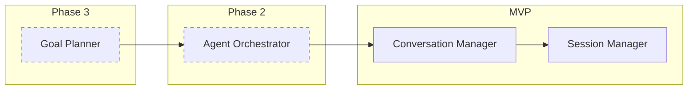

### 2.4 Tool Layer (Layer 5)

The Tool Layer is the platform's controlled access boundary for all external systems. No component in the platform accesses external data directly. Every external call goes through the Tool Gateway, which enforces access policy and creates an audit record for every invocation.

**Design Principle**: The Tool Gateway is a proxy, not a router. Every tool call arrives at the gateway, is validated, logged, and then dispatched. This single choke point enables complete observability and policy enforcement.

**Tool Gateway**:

```
Tool Gateway Responsibilities:
  1. Receive tool invocation request from Agent Runtime
  2. Validate: tool exists, user role permits it, tenant scope correct
  3. Log: pre-invocation audit record (who, what, when, target)
  4. Execute: dispatch to tool implementation
  5. Log: post-invocation record (result status, data accessed)
  6. Return: result to Agent Runtime
```

**MVP Tool Set (Read-Only)**:

| Tool | Description | Access |
|---|---|---|
| `rag_search` | Semantic search over ingested documents | Read-only |
| `document_read` | Retrieve specific document content | Read-only |
| `document_list` | List documents available to user | Read-only |
| `memory_read` | Read user's personal memory entries | Read-only |

**Future: Write Operations with Approval Workflow**

Write operations (modifying plant systems, creating work orders, updating records) require an approval workflow before execution. The Tool Gateway will route write requests to an Approval Service that notifies designated approvers and holds the request pending explicit approval.

```
Write tool flow (future):
  Agent → Gateway → Approval Service → [notify approver]
                                      → [approver approves/rejects]
                                      → Gateway → Tool execution (if approved)
                                      → Audit log (full chain recorded)
```

**RAG Engine (LlamaIndex)**:

The RAG Engine is a specialized tool within the Tool Layer responsible for document retrieval. It uses LlamaIndex for document parsing, chunking, and retrieval orchestration, backed by pgvector for vector similarity search.

```
RAG Tool Flow:
  1. Receive query + tenant_id + optional document filters
  2. Embed query using the same embedding model used for ingestion
  3. Run similarity search in pgvector (filtered by tenant_id and tags)
  4. Retrieve top-k chunks with source metadata
  5. Assemble context with citations (document name, page/section)
  6. Return context + citation list to Agent Runtime
```

**Document Ingestion Pipeline**:

```
Ingestion Flow:
  1. Receive document (PDF, DOCX, TXT, Markdown)
  2. Extract text using LlamaIndex document readers
  3. Chunk: semantic chunking with overlap (configurable)
  4. Embed: call Model Layer embedding endpoint
  5. Store: chunks + embeddings in PostgreSQL/pgvector
  6. Index: update document metadata record
  7. Audit: log ingestion event
```

### 2.5 Model Layer (Layer 6)

The Model Layer provides a unified, model-agnostic interface for all inference operations. The Agent Runtime and Tool Layer never call model providers directly — they call LiteLLM, which handles provider routing, failover, and cost tracking.

**LiteLLM Proxy**:

LiteLLM is deployed as a standalone service with its own configuration. It receives OpenAI-compatible API requests and routes them to the appropriate backend based on the model name requested.

**Model Routing Strategy**:

The platform uses a two-tier model strategy: fast models for routine interactions, heavy models for complex reasoning.

```
Fast Model (default):
  Purpose:  Conversational responses, simple Q&A, summarization
  Latency:  < 2 seconds first token
  Provider: Mistral 7B / Llama 3.1 8B on vLLM (prod) or Ollama (dev)

Heavy Model (on request or auto-escalation):
  Purpose:  Complex analysis, multi-step reasoning, code generation
  Latency:  < 10 seconds first token
  Provider: Llama 3.1 70B / Mistral Large on vLLM (prod)

Embedding Model:
  Purpose:  Document chunk embedding, query embedding for RAG
  Provider: Dedicated embedding model (e.g., nomic-embed-text on Ollama/vLLM)
```

**LiteLLM Configuration**:

```yaml
# litellm_config.yaml
model_list:
  - model_name: fast
    litellm_params:
      model: openai/mistral-7b
      api_base: http://vllm:8000/v1
      api_key: placeholder

  - model_name: heavy
    litellm_params:
      model: openai/llama-3.1-70b
      api_base: http://vllm:8000/v1
      api_key: placeholder

  - model_name: embed
    litellm_params:
      model: openai/nomic-embed-text
      api_base: http://ollama:11434/v1
      api_key: placeholder

  - model_name: fast-dev
    litellm_params:
      model: ollama/mistral
      api_base: http://ollama:11434

router_settings:
  routing_strategy: least-busy
  fallbacks:
    - fast: [fast-dev]

general_settings:
  master_key: ${LITELLM_MASTER_KEY}
  database_url: ${DATABASE_URL}
```

**Failover Behavior**:

If the primary model (vLLM) is unavailable, LiteLLM automatically falls back to the configured secondary (Ollama). This ensures the platform remains available during GPU node maintenance.

**Azure OpenAI Integration (Optional)**:

For organizations with Azure OpenAI agreements, LiteLLM can route heavy model requests to Azure OpenAI as a secondary fallback. This is disabled by default and requires explicit configuration.

### 2.6 Data Layer (Layer 7)

The Data Layer is the single source of truth for all platform state. PostgreSQL 16 with the pgvector extension provides both relational data storage and vector similarity search in a single, operationally simple system.

**Design Principle**: No separate vector database (Pinecone, Weaviate, Qdrant). pgvector provides sufficient performance for plant-scale document volumes (tens of thousands of documents) with far lower operational complexity.

**Database Schema**:

```sql
-- Tenant Registry
CREATE TABLE tenants (
    id              UUID PRIMARY KEY DEFAULT gen_random_uuid(),
    name            VARCHAR(255) NOT NULL UNIQUE,
    slug            VARCHAR(64)  NOT NULL UNIQUE,
    config          JSONB        NOT NULL DEFAULT '{}',
    is_active       BOOLEAN      NOT NULL DEFAULT true,
    created_at      TIMESTAMPTZ  NOT NULL DEFAULT NOW(),
    updated_at      TIMESTAMPTZ  NOT NULL DEFAULT NOW()
);

-- User Registry
CREATE TABLE users (
    id              UUID PRIMARY KEY DEFAULT gen_random_uuid(),
    tenant_id       UUID         NOT NULL REFERENCES tenants(id),
    external_id     VARCHAR(255) NOT NULL,  -- Entra ID object ID
    email           VARCHAR(255) NOT NULL,
    display_name    VARCHAR(255),
    role            VARCHAR(32)  NOT NULL DEFAULT 'user',  -- admin|user|viewer
    metadata        JSONB        NOT NULL DEFAULT '{}',
    is_active       BOOLEAN      NOT NULL DEFAULT true,
    last_login      TIMESTAMPTZ,
    created_at      TIMESTAMPTZ  NOT NULL DEFAULT NOW(),
    UNIQUE(tenant_id, external_id)
);

-- Conversations
CREATE TABLE conversations (
    id              UUID PRIMARY KEY DEFAULT gen_random_uuid(),
    tenant_id       UUID         NOT NULL REFERENCES tenants(id),
    user_id         UUID         NOT NULL REFERENCES users(id),
    title           VARCHAR(512),
    model           VARCHAR(128),
    metadata        JSONB        NOT NULL DEFAULT '{}',
    created_at      TIMESTAMPTZ  NOT NULL DEFAULT NOW(),
    updated_at      TIMESTAMPTZ  NOT NULL DEFAULT NOW()
);

-- Messages
CREATE TABLE messages (
    id              UUID PRIMARY KEY DEFAULT gen_random_uuid(),
    tenant_id       UUID         NOT NULL REFERENCES tenants(id),
    conversation_id UUID         NOT NULL REFERENCES conversations(id),
    role            VARCHAR(32)  NOT NULL,  -- system|user|assistant|tool
    content         TEXT         NOT NULL,
    token_count     INTEGER,
    metadata        JSONB        NOT NULL DEFAULT '{}',  -- tool calls, citations
    created_at      TIMESTAMPTZ  NOT NULL DEFAULT NOW()
);

-- Documents
CREATE TABLE documents (
    id              UUID PRIMARY KEY DEFAULT gen_random_uuid(),
    tenant_id       UUID         NOT NULL REFERENCES tenants(id),
    uploaded_by     UUID         NOT NULL REFERENCES users(id),
    filename        VARCHAR(512) NOT NULL,
    mime_type       VARCHAR(128),
    file_size_bytes BIGINT,
    storage_path    TEXT         NOT NULL,
    doc_type        VARCHAR(128),  -- procedure, manual, p&id, report
    tags            TEXT[]       NOT NULL DEFAULT '{}',
    status          VARCHAR(32)  NOT NULL DEFAULT 'pending',  -- pending|processing|ready|failed
    metadata        JSONB        NOT NULL DEFAULT '{}',
    created_at      TIMESTAMPTZ  NOT NULL DEFAULT NOW(),
    updated_at      TIMESTAMPTZ  NOT NULL DEFAULT NOW()
);

-- Document Chunks (with vector embeddings)
CREATE TABLE document_chunks (
    id              UUID PRIMARY KEY DEFAULT gen_random_uuid(),
    tenant_id       UUID         NOT NULL REFERENCES tenants(id),
    document_id     UUID         NOT NULL REFERENCES documents(id) ON DELETE CASCADE,
    chunk_index     INTEGER      NOT NULL,
    content         TEXT         NOT NULL,
    token_count     INTEGER,
    embedding       vector(1536),  -- adjust to model embedding dimension
    metadata        JSONB        NOT NULL DEFAULT '{}',  -- page, section, heading
    created_at      TIMESTAMPTZ  NOT NULL DEFAULT NOW()
);

-- Audit Logs (append-only)
CREATE TABLE audit_logs (
    id              UUID PRIMARY KEY DEFAULT gen_random_uuid(),
    tenant_id       UUID         NOT NULL,  -- no FK: audit survives user deletion
    user_id         UUID         NOT NULL,
    session_id      UUID,
    event_type      VARCHAR(128) NOT NULL,  -- chat.request, tool.invocation, doc.upload
    resource_type   VARCHAR(128),
    resource_id     UUID,
    model           VARCHAR(128),
    tools_used      TEXT[]       NOT NULL DEFAULT '{}',
    request_hash    VARCHAR(64),  -- SHA-256 of request content (for dedup)
    result_status   VARCHAR(32),  -- success|error|denied
    latency_ms      INTEGER,
    metadata        JSONB        NOT NULL DEFAULT '{}',
    created_at      TIMESTAMPTZ  NOT NULL DEFAULT NOW()
);
-- Note: audit_logs has no UPDATE/DELETE privileges granted to application user

-- Per-User Memories
CREATE TABLE memories (
    id              UUID PRIMARY KEY DEFAULT gen_random_uuid(),
    tenant_id       UUID         NOT NULL REFERENCES tenants(id),
    user_id         UUID         NOT NULL REFERENCES users(id),
    content         TEXT         NOT NULL,
    embedding       vector(1536),
    importance      FLOAT        NOT NULL DEFAULT 0.5,
    tags            TEXT[]       NOT NULL DEFAULT '{}',
    source_type     VARCHAR(64),  -- explicit|inferred|conversation
    expires_at      TIMESTAMPTZ,
    created_at      TIMESTAMPTZ  NOT NULL DEFAULT NOW(),
    updated_at      TIMESTAMPTZ  NOT NULL DEFAULT NOW()
);
```

**Indexes**:

```sql
-- Tenant isolation indexes (on every table)
CREATE INDEX idx_users_tenant           ON users(tenant_id);
CREATE INDEX idx_conversations_tenant  ON conversations(tenant_id);
CREATE INDEX idx_conversations_user    ON conversations(user_id);
CREATE INDEX idx_messages_conversation ON messages(conversation_id);
CREATE INDEX idx_messages_tenant       ON messages(tenant_id);
CREATE INDEX idx_documents_tenant      ON documents(tenant_id);
CREATE INDEX idx_documents_status      ON documents(tenant_id, status);
CREATE INDEX idx_chunks_document       ON document_chunks(document_id);
CREATE INDEX idx_chunks_tenant         ON document_chunks(tenant_id);
CREATE INDEX idx_audit_tenant          ON audit_logs(tenant_id, created_at DESC);
CREATE INDEX idx_audit_user            ON audit_logs(user_id, created_at DESC);
CREATE INDEX idx_memories_user         ON memories(user_id);

-- Vector similarity search indexes
CREATE INDEX idx_chunks_embedding ON document_chunks
    USING ivfflat (embedding vector_cosine_ops)
    WITH (lists = 100);

CREATE INDEX idx_memories_embedding ON memories
    USING ivfflat (embedding vector_cosine_ops)
    WITH (lists = 50);
```

**Row Level Security (RLS)**:

```sql
-- Enable RLS on all tenant-scoped tables
ALTER TABLE conversations ENABLE ROW LEVEL SECURITY;
ALTER TABLE messages      ENABLE ROW LEVEL SECURITY;
ALTER TABLE documents     ENABLE ROW LEVEL SECURITY;
ALTER TABLE document_chunks ENABLE ROW LEVEL SECURITY;
ALTER TABLE memories      ENABLE ROW LEVEL SECURITY;

-- Application connects with a role that sets the tenant context
CREATE POLICY tenant_isolation ON conversations
    USING (tenant_id = current_setting('app.current_tenant_id')::UUID);

-- Audit logs: application can INSERT only, not SELECT/UPDATE/DELETE
-- Admins read via a privileged role or separate read replica
```

**Auth Layer**:

The platform uses OIDC/OAuth2 via Azure Entra ID (Azure Active Directory). Users authenticate against Entra ID and receive a JWT access token. The API Gateway's auth middleware validates this token on every request.

```
Auth Flow:
  1. User navigates to platform UI
  2. UI redirects to Entra ID authorization endpoint
  3. User authenticates with corporate credentials (MFA enforced by Entra)
  4. Entra ID issues JWT access token (+ refresh token)
  5. UI includes JWT in Authorization: Bearer header on all API calls
  6. API Gateway middleware validates JWT signature against Entra JWKS endpoint
  7. Middleware extracts: sub (user ID), tenant (custom claim), roles
  8. Middleware creates RequestContext with validated principal
  9. RequestContext flows through all layers without re-validation
```

**JWT Claims**:

```json
{
  "sub": "user-object-id-from-entra",
  "oid": "user-object-id-from-entra",
  "tid": "tenant-id-from-entra",
  "email": "user@company.com",
  "name": "Display Name",
  "roles": ["PlatformUser"],
  "exp": 1708000000,
  "iss": "https://login.microsoftonline.com/{tenant-id}/v2.0"
}
```

**Platform-side role mapping** (stored in `users.role`): Entra ID provides group membership; the platform maps group membership to platform roles (`admin`, `user`, `viewer`) at first login and on each token refresh.

---

## 3. Data Flow Diagrams

### 3.1 Chat Request Flow

This is the primary user interaction pattern. A user sends a message and receives a response from an AI model, with full audit coverage.

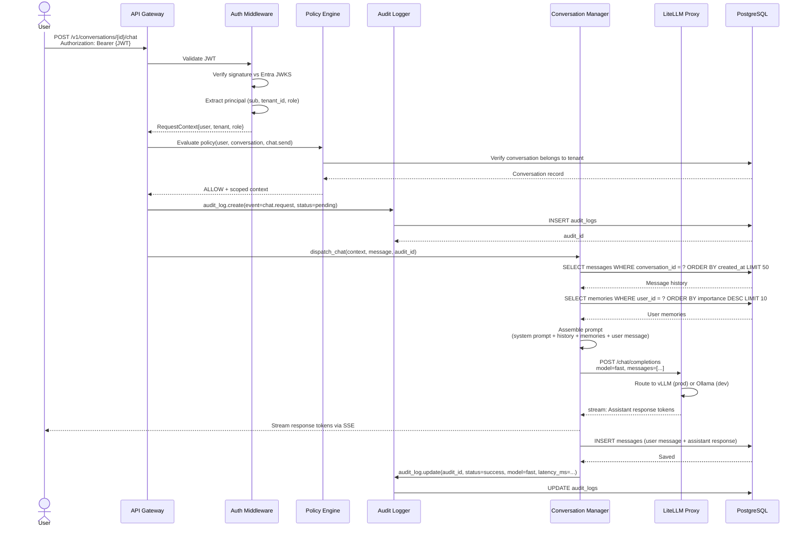

### 3.2 RAG Query Flow

The RAG (Retrieval-Augmented Generation) flow retrieves relevant document chunks and includes them as context in the model prompt, with citations returned alongside the response.

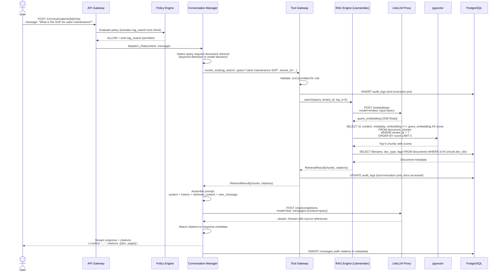

### 3.3 Document Ingestion Flow

Documents are uploaded by users and processed asynchronously through an ingestion pipeline that extracts text, chunks it, embeds it, and stores it in the vector database.

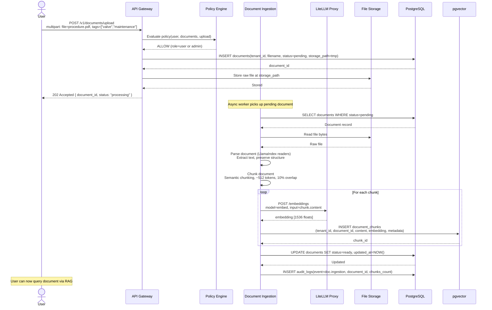

---

## 4. Security Model

The security model is built on defense-in-depth: multiple independent enforcement layers ensure that no single failure exposes unauthorized data or capability.

### 4.1 Security Layers

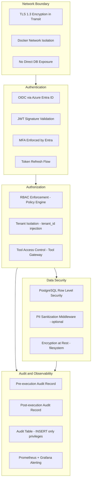

### 4.2 Tenant Isolation

Tenant isolation is enforced at three independent layers:

**Layer 1 — Application (Policy Engine)**
The Policy Engine extracts `tenant_id` from the validated JWT and injects it into the `RequestContext`. Every database query issued by the application includes `WHERE tenant_id = :current_tenant_id` as a mandatory filter.

**Layer 2 — Database Session (SET LOCAL)**
Before executing any query, the application issues:
```sql
SET LOCAL app.current_tenant_id = :tenant_id;
```
This sets a session-scoped parameter that RLS policies read.

**Layer 3 — PostgreSQL Row Level Security**
RLS policies on all tenant-scoped tables enforce:
```sql
CREATE POLICY tenant_isolation ON documents
    USING (tenant_id = current_setting('app.current_tenant_id')::UUID);
```
Even if the application has a query bug that omits the `WHERE tenant_id` clause, the database itself rejects the cross-tenant access.

### 4.3 Authentication and JWT

- JWT tokens are validated on every request using the Entra ID public key (JWKS endpoint)
- JWKS keys are cached with a 1-hour TTL and refreshed proactively
- Expired tokens are rejected; token refresh is handled client-side
- The `sub` claim is the authoritative user identifier
- Custom claim `extension_PlatformTenantId` carries the tenant identifier set by Entra ID app role assignment

### 4.4 RBAC Enforcement

RBAC is enforced in the Policy Engine before any work begins. The evaluation is:

```
1. Is the user active? (users.is_active = true)
2. Is the tenant active? (tenants.is_active = true)
3. Does the user's role permit the requested operation on this resource type?
4. If a specific resource (conversation, document): does it belong to this tenant?
5. For user-owned resources (conversations): does it belong to this user?
```

Any `NO` answer results in an immediate `403 Forbidden` with an audit record.

**Resource-Level Filtering via Metadata Tags**:

Documents can be tagged with sensitivity labels (`restricted`, `confidential`, `public`). The Policy Engine filters document search results based on the user's role and the document's tags. A `viewer` role cannot see documents tagged `restricted` even if they are in the same tenant.

### 4.5 Tool Gateway Security

The Tool Gateway is the only component permitted to access external systems. This provides:

- **Principle of Least Privilege**: Each tool is scoped to the minimum access needed
- **Complete Audit Trail**: Every tool invocation (pre and post) is logged
- **MVP Write Protection**: All external tools are read-only in MVP. No write operations are possible regardless of role
- **Future Approval Workflow**: Write operations will require explicit human approval through a notification and confirmation workflow

### 4.6 Audit System

The audit system is designed to be tamper-resistant:

- The application database user has `INSERT` privilege on `audit_logs` but NOT `UPDATE` or `DELETE`
- Audit records are written before and after every significant operation
- The `request_hash` field (SHA-256) allows detection of request tampering in forensic analysis
- Audit records include: `user_id`, `tenant_id`, `event_type`, `resource_type`, `resource_id`, `model`, `tools_used`, `result_status`, `latency_ms`, `metadata`, `created_at`

**Audit Events**:

| Event Type | Trigger |
|---|---|
| `auth.login` | Successful token validation |
| `auth.denied` | Failed auth or expired token |
| `policy.denied` | RBAC check failed |
| `chat.request` | Chat message submitted |
| `chat.response` | Chat response completed |
| `tool.invocation` | Tool called via Tool Gateway |
| `doc.upload` | Document upload initiated |
| `doc.ingestion` | Document ingestion completed |
| `doc.access` | Document content retrieved |
| `search.query` | RAG search performed |
| `admin.user_created` | Admin created a user |
| `admin.role_changed` | User role modified |

### 4.7 Network Security

```
External Traffic:
  HTTPS (443) → Load Balancer/nginx → API Gateway
  Direct access to API:8000 blocked at network boundary

Internal Docker Network (agent-network):
  api ↔ db (5432)      — app queries only
  api ↔ litellm (4000) — inference requests
  api ↔ ollama (11434) — dev inference
  api ↔ vllm (8001)    — prod inference
  db  ← NOT exposed     — no external access to PostgreSQL
  prometheus (9090) ← scrape targets
  grafana (3000)    — internal access only (no external exposure)
```

### 4.8 PII Sanitization (Optional)

An optional middleware layer can scan prompts for PII patterns (employee IDs, process values, equipment serial numbers) before they reach the model. This is configurable per tenant:

```python
# Tenant config
{
    "pii_sanitization": {
        "enabled": true,
        "patterns": ["employee_id", "ip_address"],
        "action": "redact"  # or "warn" or "block"
    }
}
```

---

## 5. Tech Stack

### 5.1 Stack Overview

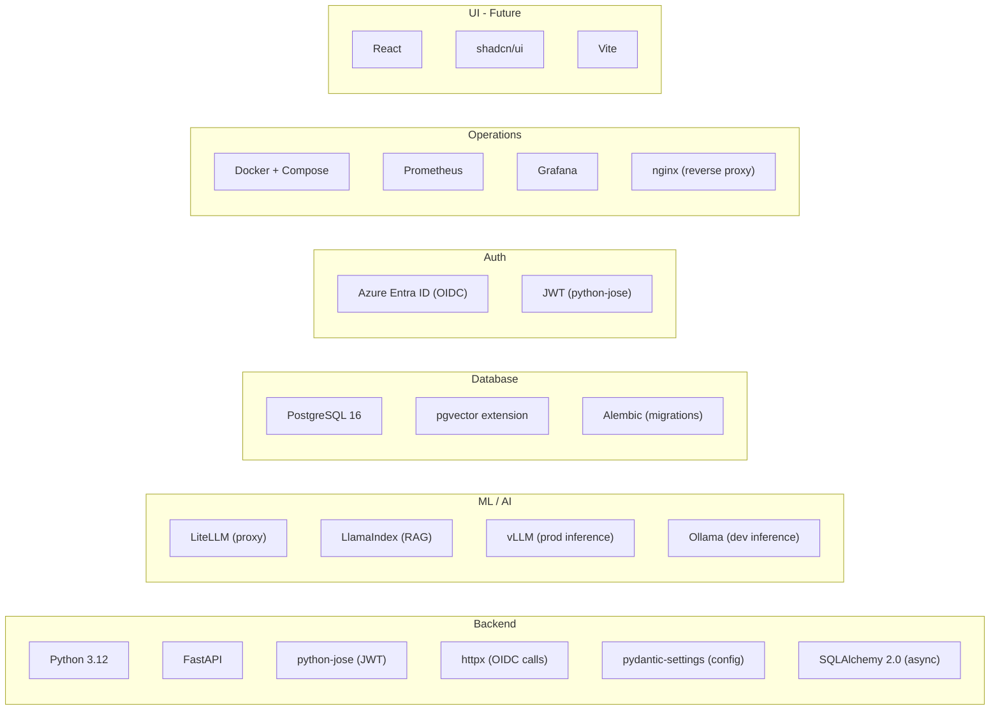

### 5.2 Dependency Rationale

| Component | Choice | Rationale |
|---|---|---|
| Python 3.12 | Runtime | Mature async support, rich AI/ML ecosystem |
| FastAPI | Web framework | Native async, automatic OpenAPI docs, type safety via Pydantic |
| PostgreSQL 16 | Database | ACID compliance, RLS, pgvector, operational maturity |
| pgvector | Vector search | Eliminates separate vector DB; sufficient for plant-scale volumes |
| LiteLLM | Model proxy | Model-agnostic, OpenAI-compatible API, failover, cost tracking |
| LlamaIndex | RAG framework | Production-ready document parsing, chunking, retrieval orchestration |
| vLLM | Production inference | High-throughput GPU inference, PagedAttention, OpenAI-compatible |
| Ollama | Development inference | Zero-config local inference, same API as vLLM |
| python-jose | JWT | Lightweight, well-audited JWT library |
| SQLAlchemy 2.0 | ORM | Async support, explicit query control, battle-tested |
| Alembic | DB migrations | Schema version control, rollback support |
| Docker Compose | Orchestration | MVP deployment without Kubernetes complexity |
| Prometheus + Grafana | Observability | Industry standard, self-hosted, no vendor dependency |

### 5.3 Language and Runtime Standards

```
Python version:     3.12 (minimum)
Async pattern:      asyncio throughout (no sync DB calls on request path)
Type safety:        Pydantic models for all API inputs and outputs
Configuration:      pydantic-settings with env var override
Dependency mgmt:    uv (fast, reproducible, lockfile-based)
Code formatting:    ruff (lint + format)
Testing:            pytest + pytest-asyncio
```

---

## 6. Deployment Architecture

### 6.1 Docker Compose Services

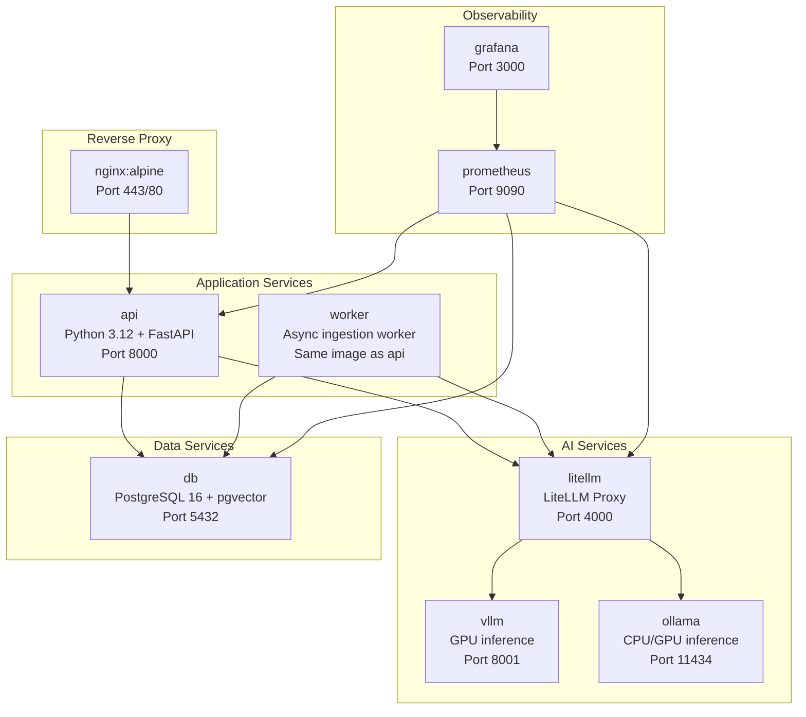

### 6.2 docker-compose.yml Structure

```yaml
# docker-compose.yml — Enterprise Agent Platform

version: "3.9"

x-common-env: &common-env
  DATABASE_URL: postgresql+asyncpg://platform:${DB_PASSWORD}@db:5432/platform
  LITELLM_BASE_URL: http://litellm:4000
  ENTRA_TENANT_ID: ${ENTRA_TENANT_ID}
  ENTRA_CLIENT_ID: ${ENTRA_CLIENT_ID}
  SECRET_KEY: ${SECRET_KEY}
  LOG_LEVEL: ${LOG_LEVEL:-INFO}

services:

  # --- Reverse Proxy ---
  nginx:
    image: nginx:alpine
    ports:
      - "80:80"
      - "443:443"
    volumes:
      - ./nginx/nginx.conf:/etc/nginx/nginx.conf:ro
      - ./nginx/certs:/etc/nginx/certs:ro
    depends_on: [api]
    networks: [agent-network]

  # --- Application API ---
  api:
    build:
      context: .
      dockerfile: Dockerfile
      target: production
    environment:
      <<: *common-env
      SERVICE_TYPE: api
    ports:
      - "8000:8000"  # internal only; nginx proxies
    volumes:
      - document-storage:/app/storage
    depends_on:
      db:
        condition: service_healthy
      litellm:
        condition: service_started
    networks: [agent-network]
    healthcheck:
      test: ["CMD", "curl", "-f", "http://localhost:8000/health"]
      interval: 30s
      timeout: 10s
      retries: 3

  # --- Async Worker (Document Ingestion) ---
  worker:
    build:
      context: .
      dockerfile: Dockerfile
      target: production
    environment:
      <<: *common-env
      SERVICE_TYPE: worker
    volumes:
      - document-storage:/app/storage
    depends_on:
      db:
        condition: service_healthy
      litellm:
        condition: service_started
    networks: [agent-network]

  # --- Database ---
  db:
    image: pgvector/pgvector:pg16
    environment:
      POSTGRES_DB: platform
      POSTGRES_USER: platform
      POSTGRES_PASSWORD: ${DB_PASSWORD}
    volumes:
      - postgres-data:/var/lib/postgresql/data
      - ./db/init:/docker-entrypoint-initdb.d:ro
    networks: [agent-network]
    healthcheck:
      test: ["CMD-SHELL", "pg_isready -U platform -d platform"]
      interval: 10s
      timeout: 5s
      retries: 5
    # NOTE: no ports exposed externally

  # --- LiteLLM Model Proxy ---
  litellm:
    image: ghcr.io/berriai/litellm:main-latest
    environment:
      LITELLM_MASTER_KEY: ${LITELLM_MASTER_KEY}
      DATABASE_URL: postgresql://platform:${DB_PASSWORD}@db:5432/platform
    volumes:
      - ./litellm/litellm_config.yaml:/app/config.yaml:ro
    command: ["--config", "/app/config.yaml", "--port", "4000"]
    ports:
      - "4000:4000"  # internal only
    depends_on:
      db:
        condition: service_healthy
    networks: [agent-network]

  # --- vLLM (Production GPU Inference) ---
  vllm:
    image: vllm/vllm-openai:latest
    runtime: nvidia
    environment:
      HUGGING_FACE_HUB_TOKEN: ${HF_TOKEN}
    command:
      - "--model"
      - "${VLLM_MODEL:-mistralai/Mistral-7B-Instruct-v0.3}"
      - "--port"
      - "8001"
      - "--tensor-parallel-size"
      - "${VLLM_TP_SIZE:-1}"
    ports:
      - "8001:8001"  # internal only
    volumes:
      - model-cache:/root/.cache/huggingface
    deploy:
      resources:
        reservations:
          devices:
            - driver: nvidia
              count: all
              capabilities: [gpu]
    networks: [agent-network]
    profiles: [production]  # only started in production profile

  # --- Ollama (Development Inference) ---
  ollama:
    image: ollama/ollama:latest
    ports:
      - "11434:11434"  # internal only
    volumes:
      - ollama-models:/root/.ollama
    networks: [agent-network]
    profiles: [development]  # only started in development profile

  # --- Prometheus ---
  prometheus:
    image: prom/prometheus:latest
    volumes:
      - ./monitoring/prometheus.yml:/etc/prometheus/prometheus.yml:ro
      - prometheus-data:/prometheus
    ports:
      - "9090:9090"  # internal access only
    networks: [agent-network]

  # --- Grafana ---
  grafana:
    image: grafana/grafana:latest
    environment:
      GF_SECURITY_ADMIN_PASSWORD: ${GRAFANA_PASSWORD}
      GF_USERS_ALLOW_SIGN_UP: "false"
    volumes:
      - grafana-data:/var/lib/grafana
      - ./monitoring/grafana/dashboards:/etc/grafana/provisioning/dashboards:ro
      - ./monitoring/grafana/datasources:/etc/grafana/provisioning/datasources:ro
    ports:
      - "3000:3000"  # internal access only
    depends_on: [prometheus]
    networks: [agent-network]

networks:
  agent-network:
    driver: bridge
    internal: false  # api needs outbound for Entra ID OIDC

volumes:
  postgres-data:
  document-storage:
  model-cache:
  ollama-models:
  prometheus-data:
  grafana-data:
```

### 6.3 Environment Profiles

| Profile | Services Active | Use Case |
|---|---|---|
| `development` | api, worker, db, litellm, ollama, prometheus, grafana | Local development, no GPU required |
| `production` | api, worker, db, litellm, vllm, nginx, prometheus, grafana | Plant deployment with GPU inference |

```bash
# Development
docker compose --profile development up

# Production
docker compose --profile production up
```

### 6.4 Repository Structure

```
enterprise-agent-platform/
  src/
    api/
      v1/
        routers/          # FastAPI route handlers
        middleware/       # Auth, rate limit, audit, PII
        dependencies.py
      app.py
      config.py
    core/
      security/           # JWT validation, OIDC client
      policy/             # RBAC enforcer, tenant isolator
      audit/              # Audit logger
    runtime/
      conversation.py     # Conversation manager
      session.py          # Session manager
    tools/
      gateway.py          # Tool Gateway
      registry.py         # Tool manifest
      rag/                # LlamaIndex integration
      ingestion/          # Document processing pipeline
    models/
      client.py           # LiteLLM client wrapper
      router.py           # Fast/heavy model routing logic
    db/
      models.py           # SQLAlchemy models
      session.py          # Async session factory
      migrations/         # Alembic migrations
  tests/
    unit/
    integration/
    e2e/
  docs/
    architecture/
      ARCHITECTURE.md     # This document
    api/
    operations/
  docker/
    Dockerfile
    docker-compose.yml
    docker-compose.override.yml
  litellm/
    litellm_config.yaml
  monitoring/
    prometheus.yml
    grafana/
  nginx/
    nginx.conf
  scripts/
    setup.sh
    migrate.sh
    seed_admin.py
```

---

## 7. Future Extensibility

The platform's layered architecture is designed to accommodate significant capability additions without requiring structural changes. Each future capability slots into an existing layer or extends an existing component.

### 7.1 Multi-Agent Orchestration

**Target Layer**: Agent Runtime (Layer 4)

**Architecture Extension**:

The Agent Orchestrator is added to the Agent Runtime as a new component that sits above the Conversation Manager. It receives high-level task requests, decomposes them into agent steps, and coordinates execution across specialist agents.

```mermaid
graph TB
    subgraph CURRENT["Current - Single Agent"]
        CM1[Conversation Manager]
        LP1[LiteLLM]
        TG1[Tool Gateway]
    end

    subgraph FUTURE["Phase 2 - Multi-Agent"]
        AO[Agent Orchestrator]
        A1[Specialist Agent 1<br/>Document Analysis]
        A2[Specialist Agent 2<br/>Procedure Lookup]
        A3[Specialist Agent 3<br/>Calculations]
        CM2[Conversation Manager]
        LP2[LiteLLM]
        TG2[Tool Gateway]
    end

    AO --> A1 & A2 & A3
    A1 & A2 & A3 --> CM2
    CM2 --> LP2
    CM2 --> TG2

    style AO fill:#2d1b2e,stroke:#9b59b6
    style A1 fill:#2d1b2e,stroke:#9b59b6
    style A2 fill:#2d1b2e,stroke:#9b59b6
    style A3 fill:#2d1b2e,stroke:#9b59b6
```

**Design Consideration**: The Orchestrator uses the same Tool Gateway and Model Layer as individual agents. Security enforcement does not change — each agent invocation passes through the same Policy Engine checks.

**Implementation Path**:

1. Define `AgentSpec` schema (capabilities, tools, model preference)
2. Implement `AgentOrchestrator` class with task graph support
3. Register specialist agent types in Tool Registry
4. Extend Conversation Manager to handle multi-agent context assembly
5. Add orchestration events to audit log

### 7.2 Goal Planning Service

**Target Layer**: Agent Runtime (Layer 4) — new Planner component

**Architecture Extension**:

The Goal Planner is a separate service (or module within the Agent Runtime) that accepts high-level user objectives and produces a structured task graph. The Orchestrator then executes the graph.

```mermaid
graph LR
    U[User Goal] --> GP[Goal Planner]
    GP --> TG_PLAN[Task Graph]
    TG_PLAN --> AO[Agent Orchestrator]
    AO --> EXEC[Execution]
    EXEC --> RESULT[Result]

    GP -.->|uses| HEAVY[Heavy Model<br/>for decomposition]

    style GP fill:#2d1b2e,stroke:#9b59b6
```

**Key Design Decisions for Future Planner**:

- The Planner itself is stateless — the task graph is persisted in the database
- Failed steps can be retried without replanning
- The user can inspect the task graph before execution ("plan approval" UX)
- Goal planning uses the heavy model tier (70B+) for decomposition quality

### 7.3 Write Operations with Approval Workflow

**Target Layer**: Tool Layer (Layer 5) — Approval Workflow extension to Tool Gateway

**Architecture Extension**:

Write tools are registered in the Tool Registry with `"requires_approval": True`. The Tool Gateway detects this flag and routes write requests through the Approval Service instead of executing immediately.

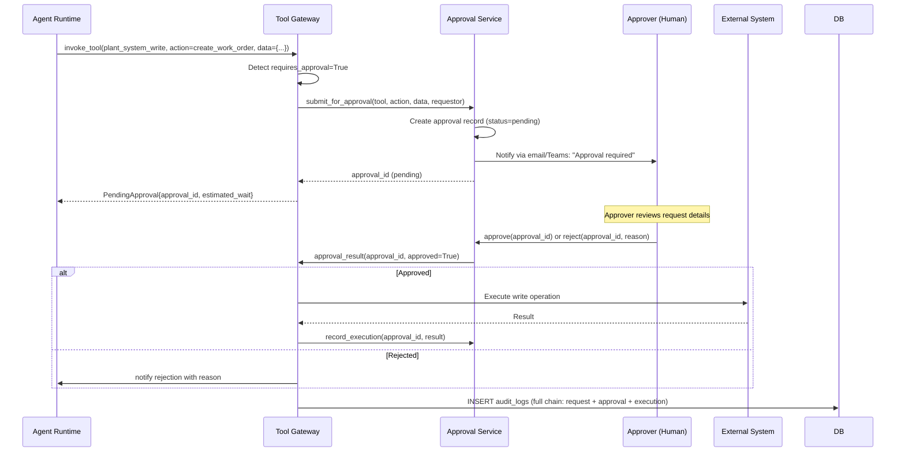

**Approval Service Requirements**:

- Approval records stored in database with full audit trail
- Configurable approver list per tool and per tenant
- Notification via configurable channels (email, Microsoft Teams webhook)
- Approval timeout with configurable auto-reject or escalation
- Approver must re-authenticate before approving (prevents stale session approvals)

### 7.4 Team Shared Spaces

**Target Layer**: Data Layer (Layer 7) + Policy Engine (Layer 3)

**Architecture Extension**:

Team shared spaces are implemented as a "team tenant" concept: a virtual tenant that multiple users from different base tenants can access simultaneously. This requires:

1. **Database**: Add a `teams` table and `team_memberships` table
2. **Policy Engine**: Extend RBAC to check both user's base tenant AND team memberships
3. **Data Layer**: Documents and conversations can be owned by a team, not just a user or tenant

```sql
CREATE TABLE teams (
    id          UUID PRIMARY KEY DEFAULT gen_random_uuid(),
    tenant_id   UUID NOT NULL REFERENCES tenants(id),  -- owning tenant
    name        VARCHAR(255) NOT NULL,
    slug        VARCHAR(64)  NOT NULL,
    config      JSONB        NOT NULL DEFAULT '{}',
    created_at  TIMESTAMPTZ  NOT NULL DEFAULT NOW()
);

CREATE TABLE team_memberships (
    team_id     UUID NOT NULL REFERENCES teams(id),
    user_id     UUID NOT NULL REFERENCES users(id),
    team_role   VARCHAR(32) NOT NULL DEFAULT 'member',  -- owner|member|viewer
    joined_at   TIMESTAMPTZ NOT NULL DEFAULT NOW(),
    PRIMARY KEY (team_id, user_id)
);
```

**Policy Engine Extension**:

The Policy Engine's authorization check is extended to evaluate team membership in addition to base tenant role. A user can access team resources if:
- They are a member of the team, AND
- Their team role permits the requested operation

**No Breaking Changes**: Existing single-user conversations and documents are unaffected. Team resources are a parallel resource type, not a replacement.

### 7.5 Extensibility Principles

The architecture supports these future capabilities without structural change because of three foundational decisions:

**1. Tool Gateway as Universal Choke Point**: Adding new tool capabilities requires only registering a new tool in the Tool Registry and implementing the tool handler. All security, audit, and routing logic is inherited automatically.

**2. LiteLLM as Model Abstraction**: Adding a new model provider (future local models, new GPU hardware) requires only updating `litellm_config.yaml`. No application code changes needed.

**3. Tenant-Scoped Data Model**: The `tenant_id` on every table and the RLS policies make it possible to add new organizational structures (teams, projects, departments) as overlay concepts without restructuring the base schema.

---

## 8. Architectural Decision Records

### ADR-001: Single Database (PostgreSQL + pgvector) Over Dedicated Vector DB

**Decision**: Use PostgreSQL 16 with the pgvector extension for both relational data and vector similarity search.

**Rationale**: At plant scale (tens of thousands of documents, hundreds of concurrent users), pgvector provides sufficient retrieval performance without the operational overhead of running and maintaining a separate vector database service. Operational simplicity is a first-class architectural concern for on-premises industrial deployments.

**Trade-off**: If document volumes exceed several million chunks, pgvector query performance may degrade and migration to a dedicated vector database would be warranted. This is an acceptable future risk.

---

### ADR-002: LiteLLM as Model Proxy Over Direct Provider Integration

**Decision**: All model calls go through a LiteLLM proxy, never directly to model providers.

**Rationale**: Direct provider integration creates tight coupling between application code and model provider APIs. LiteLLM provides a stable OpenAI-compatible interface, enables transparent failover between vLLM, Ollama, and Azure OpenAI, and adds cost tracking and request logging with no application code changes.

**Trade-off**: LiteLLM is an additional service to operate. In the event of LiteLLM bugs or unavailability, inference is blocked. Mitigated by LiteLLM's operational maturity and health-check configuration.

---

### ADR-003: Read-Only Tool Access in MVP

**Decision**: All tools in the MVP are read-only. Write operations to external systems are deferred to Phase 2 with an approval workflow.

**Rationale**: The risk of an AI agent making unchecked writes to plant systems (creating work orders, modifying configurations) in an MVP deployment is unacceptable. Read-only MVP establishes trust with plant operations teams and provides time to design and validate the approval workflow before enabling writes.

**Trade-off**: Limits MVP utility for users who need write automation. Accepted as a deliberate risk management decision.

---

### ADR-004: OIDC via Azure Entra ID Over Internal Auth

**Decision**: Authentication is fully delegated to Azure Entra ID (Azure Active Directory) via OIDC.

**Rationale**: Enterprise plants already have Entra ID as their identity provider. Delegating to it provides MFA enforcement, conditional access policies, and integration with existing IAM governance at zero additional implementation cost. Building a separate credential store would be a security regression.

**Trade-off**: Dependency on Entra ID availability. Mitigated by JWKS key caching so existing validated sessions survive brief Entra ID disruptions.

---

### ADR-005: Docker Compose Over Kubernetes for MVP

**Decision**: Use Docker Compose for MVP deployment rather than Kubernetes.

**Rationale**: Kubernetes introduces significant operational complexity (cluster management, RBAC, ingress controllers, persistent volume claims) that is inappropriate for an MVP in an industrial environment where the operations team may not have Kubernetes expertise. Docker Compose provides sufficient orchestration for the current scale.

**Trade-off**: Docker Compose does not provide automatic failover, rolling updates, or horizontal pod autoscaling. These capabilities would require migration to Kubernetes in a Phase 2 scaling scenario. The architecture is designed to make this migration straightforward (all services are containerized, stateless, and configuration-driven).

---

*End of Architecture Design Document — v1.0.0*
*Next Review: Prior to Phase 2 implementation kickoff*
